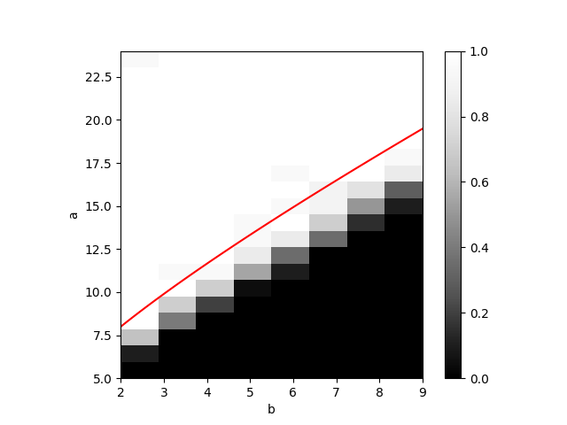

# SBMSDP2
This repository uses semi-definite programming to recover labels of stochastic block model.

## Note
The code in this repository can only recover symmetric SBM with two underlining communities.
Symmetric SBM means that the two communities have equal size.

The SBM generator is $\textrm{SBM}(n, \frac{a \log n}{n}, \frac{b \log n}{n})$.

## Sample code
```Python
from sbmsdp import sbm2, sdp2
G = sbm2(100, 16, 4)
X = sdp2(G)
print(X)
```
## Phase transition
We reproduce the experiment of [1].



## Reference
[1] Abbe, Emmanuel, Afonso S. Bandeira, and Georgina Hall. "Exact recovery in the stochastic block model." IEEE Transactions on Information Theory 62.1 (2015): 471-487.